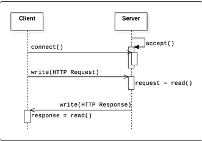

# HTTP 1.1 Server in C
Simple HTTP server from scratch written in C. I decided to create this personal project to practice some basic C programming while also applying some computer networking knowledge I learned in class.

## Demo


## Usage
Assuming on Linux/Unix machine.
``` bash
git clone https://github.com/jamesyoung-15/http-server.git
cd http-server
gcc http-server.c -o http-server.o
./http-server.o
```
Then go to http://localhost:4545 on same machine. When using another machine use server IP eg. 192.168.0.15:4545. To access other files, state the file path (in this directory) eg. http://localhost:4545/images/testpic.png.

## Project Write-Up
### Background Info
<details open><summary><h5>Collapse/Expand</h5></summary>
HTTP is an application layer protocol that defines how a browser and server communicates and delivers data. HTTP mostly uses TCP for the transport protocol. In order to implement the transport protocol, the use of sockets and socket programming is required to establish a communication link between the client and server. Below is a diagram that shows how a typical TCP connection can be established.


Very simply, on the server side we first create a socket. Then, we bind the socket to an IP address and port. Afterwards, the server socket will listen for incoming connection and once the client's connection is accepted, the client and server can transfer data to each other. The client side is much simpler, where we just need to create a socket and connect to the server. Once a communication is finished, we close the socket. For code of a simple TCP server and client, see [simple_tcp folder](https://github.com/jamesyoung-15/http-server/tree/main/simple_tcp).

Building on top of the TCP transport protocol described above, HTTP adds it's application layer protocol as shown below:



As seen, once connection is established the client writes an HTTP request. Whilst the format and content of HTTP request differ based on different HTTP versions, certain principles stay the same. The request message should consist of a method (eg. GET) that tells the server what it should do. Next should be the path to the requested target (eg. /index.html). Finally it should include the HTTP version. Here is an example of a request message: 
```
GET /index.html HTTP/1.1
Host: developer.mozilla.org
Accept-Language: fr
```
Note after the `GET /index.html HTTP/1.1` start line, below it are examples of HTTP headers that pass extra info.

Once the server receives the request, it will send out an HTTP response where the first line is the status line that includes the HTTP version, status code (eg. 404), and a status text (eg. Not Found). Once again, HTTP headers can be included for extra info. Below is an example of an HTTP response:
```
HTTP/1.1 200 OK
Content-Type: text/html
Content-Length: 88
``` 
In HTTP 2 uses frames but this project is focused on HTTP 1.1. For more info check the Mozilla Developer docmentation listed below.
</details>

### Code Explanation
<details open><summary><h5>Collapse/Expand</h5></summary>

The code follows closely to the logic and steps explained in the background above. 

1. First part of the program just follows basic socket programming
    - Create a server's socket
    ```
    //check man socket for more detail
    serverFd = socket(AF_INET, //domain type
        SOCK_STREAM, //Use TCP (UDP is SOCK_DGRAM)
        0 //protocol most of the time set to 0
        );
    ```
    - Bind socket to accept any local address and port 4545
    ```
    //check man bind for more detail
    server_address.sin_family = AF_INET; //set to AF_INET for TCP and UDP
    server_address.sin_addr.s_addr = htonl(INADDR_ANY); //accept any ip address, htonl to convert host byte order to network byte order
    server_address.sin_port = htons(PORT); //listen on defined port, htons to convert host byte order to network byte order
    ```
    - Listen for connection
    ```
    //check man listen for more detail
    listen(serverFd, SOMAXCONN) //SOMAXCONN is max number of connections
    ```
2. Now that we created and binded the socket and it is ready to connect, the next part is where we implement the http protocol. We set this part in an infinite for loop.

    - Accept client's connection, client's socket is stored in clientFd
    ```
    //check man accept for more detail
    clientFd = accept(serverFd, //server's socket
    (struct sockaddr *)&client_address, //pointer to client's address struct info. we use (struct sockaddr *) to cast since we need a pointer
    (socklen_t *) &client_address); //pointer to client's address info size, once again we cast with (socklen_t *)
    ```

    - Read and store client's HTTP request generated from web browser to `buf`.
    ```
    int valread = read(clientFd,buf,sizeof(buf));
    ```

    - From the HTTP request, we find what the client resource/file the client has requested. The code is a bit long and not the greatest solution:
        - The first line HTTP request is something like this `GET /src/images/bongo-cat.gif HTTP/1.1`. We are only concerned with the file path `src/images/bongo-cat.gif`. Hence I looped starting from 5 and ending before HTTP/1.1.
        ```
        //skip GET / (hence i=5) to get to filepath, stop once space is detected (means filepath ended) and set it to null
        for(int i=5;i<BUFFERSIZE;i++)
        {
            if(buf[i]==' ')
            {
                targetPath[i-5]='\0';
                targetLength=i-5;
                break;
            }
        }
        ```
        - If the client isn't looking for a specific file (ie. localhost:4545), then we default to index.html:
        ```
        if(targetLength ==0 && (strcmp(targetPath, "\0")==0))
        {
            printf("No specific file/target name. Default to index.html\n");
            strncpy(targetPath, "src/index.html", sizeof(targetPath));
            targetLength = 10;
        }
        ```
        - Otherwise we store the file path.
        ```
        //get target path from http request buffer and put to char array
        else
        {
            for(int i = 0;i<targetLength;i++)
            {
                targetPath[i] = buf[i+5];
            }
        }
        ```
        - We need the file extension to specify in the HTTP response. So we just cutoff the file name (ie. everything before the '.')
        ```
        //loop through file name
        for (int i=0;i<PATHSIZE;i++)
        {
            if(targetPath[i]=='.')
            {
                break;
            }
            fileNameLength++;
        }
        fileNameLength+=1; //add one to include the dot '.'
        //loop through extension, stops at null
        for(int i = fileNameLength;i<PATHSIZE;i++)
        {
            if(targetPath[i]=='\0')
            {
                break;
            }
            fileExtension[i-fileNameLength]=targetPath[i];
        }
        ```
    - Once we obtained the file path and extension, we open the file with `fopen`.
    ```
    //open file
    FILE *file = fopen(targetPath,"rb");
    ```
    - Check for null, if null means file doesn't exist and we return error status 404.
    ```
    //if can't open file, return null and write 404 error
    if(file == NULL)
    {
        printf("Client requested file cannot be found, error status 404.\n");
        sprintf(httpResponse,"HTTP/1.1 404 Not Found\nContent-Type: text/plain\n\n404 Not Found");
        printf("Response:\n%s\n",httpResponse);
        write(clientFd,httpResponse,strlen(httpResponse));
    }
    ```
    - Otherwise we then use the extension name from before and match it with the struct `contentType` to get the correct content type header for the HTTP response. Then we write and send the HTTP response to the client, then send the file requested to the client.

    ```
    //else send http response and requested file
    else{
        //using extension name to get relevant content type field string, eg. html will mean content type is text/html
        for(int i=0;contentType[i].extension!=0;i++)
        {
            if(strncmp(fileExtension, contentType[i].extension, strlen(contentType[i].extension))==0)
            {
                httpContent = contentType[i].extension;
                break;
            }
        }
        //write and send http response
        sprintf(httpResponse,"HTTP/1.1 200 OK\nServer: James' Server v0.1\nContent-Type: %s\n\n",httpContent);
        write(clientFd, httpResponse, strlen(httpResponse));
        size_t n;
        char fileBuf[BUFFERSIZE]={0};
        //send file
        while((n=fread(fileBuf,1,sizeof(fileBuf),file))>0)
        {
            if(send(clientFd,fileBuf,n,0)!=n)
            {
                perror("Couldn't send file.\n");
                break;
            }
        }
        //close requested file, remember can't be null or else seg fault so keep it in this condition
        fclose(file);
    }
    ```
And that's it. It might not be the cleanest or best solution especially with regards to char and string but it works.

</details>

### Next Steps/Improvements to make
<details open><summary><h5>Collapse/Expand</h5></summary>
This HTTP server is very simple and I plan to work on it a bit more when I have time. For performance, the server uses an iterative approach lacks multi-threading to handle concurrent connections. There are also probably many security issues with this server. For example, the server could be vulnerable to buffer overflow attack that can be exploited with a HTTP GET request.
</details>

## Resources Used
- [Beej Guide](https://beej.us/guide/bgnet/html/#client-server-background)
- [Mozilla Developer Documentation](https://developer.mozilla.org/en-US/docs/Web/HTTP/Overview)
- [Youtube Playlist of Labs of CSE4202 from Inha University](https://www.youtube.com/playlist?list=PLZIwlOSv75K7jXcVABdIo3wyKp5NwXKlW) 
- [Computer Networking: A Top Down Approach](https://gaia.cs.umass.edu/kurose_ross/index.php) (Textbook used in course I'm taking)
- [Blog Post Example](https://bruinsslot.jp/post/simple-http-webserver-in-c/)
- [Medium Blog Post](https://medium.com/from-the-scratch/http-server-what-do-you-need-to-knoPostExample-simple-http-server-from-scratch-d1ef8945e4fa)
-  RFC 7230, RFC 7231, RFC 7232, RFC 7233, RFC 7234, RFC 7235 (official resources for HTTP 1.1)
- `Man` pages of `socket`, `man 7 ip`, etc. 